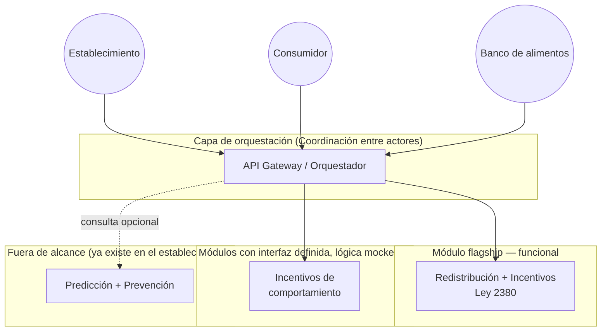

# Arquitectura

## Principio de diseño

Una aplicación web responsive compuesta por **módulos independientes** detrás de una interfaz común, coordinados por una capa de **orquestación**. Cada módulo puede evolucionar, reemplazarse o integrarse a un sistema externo (ERP de un establecimiento, app de banco, plataforma de seguros) sin reescribir los demás.

Esto es una decisión deliberada frente al tiempo disponible: en vez de repartir el esfuerzo en partes iguales entre cuatro módulos y no terminar ninguno, se definió **una interfaz común para los cuatro**, y se invirtió el tiempo real de implementación en uno solo.



## Por qué este recorte de alcance

| Módulo | Decisión | Justificación |
|---|---|---|
| Redistribución + Incentivos | Construir completo | Es el punto de mayor apalancamiento: ataca la brecha de adopción de donación y tiene un incentivo económico real y vigente (Ley 2380) que el usuario puede verificar hoy mismo |
| Coordinación entre actores | Definir interfaz, implementar lo mínimo para que el flagship funcione | No tiene valor por sí sola sin al menos un módulo real conectado; se construye "a medida" que el flagship la necesita |
| Incentivos de comportamiento | Mockear | Requiere datos de comportamiento de usuario a lo largo del tiempo que no existen en un hackathon; se documenta como roadmap |
| Predicción + Prevención | Excluir | Los establecimientos ya cuentan con esos datos y esa infraestructura (evidencia del reto); construirla sería duplicar, no resolver |

## Interfaz común entre módulos

Cada módulo expone (o simula) el mismo contrato mínimo para que la orquestación sea real y no solo prometida:

```
POST /modulos/{modulo}/excedente
GET  /modulos/{modulo}/estado/{id}
GET  /modulos/{modulo}/metricas
```

- `redistribucion-incentivos`: implementación real — registra el excedente, genera el soporte de donación y lo asocia a un banco de alimentos.
- `coordinacion-actores`: real — enruta el excedente registrado hacia el actor correspondiente (banco de alimentos más cercano/disponible).
- `incentivos-comportamiento`: mock — responde con datos simulados de "puntos" o "nudges" que en una v2 se calcularían con comportamiento real.
- `prediccion-prevencion`: no implementado — placeholder documentado para integración futura con el sistema del establecimiento (no se construye desde cero).

## Stack sugerido (a definir por el equipo según lo que ya dominen)

No se fija stack todavía para no perder tiempo discutiéndolo: cualquier framework web responsive (React, Vue, o incluso HTML+JS simple) sirve para el MVP, siempre que respete la interfaz de módulos de arriba. Definir y registrar la elección final en este documento apenas se tome la decisión.
