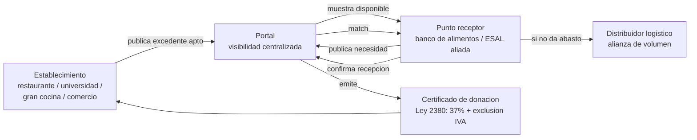

# Arquitectura

## Qué es el producto

Un **portal web de gestión** (responsive, profesional, sin elementos decorativos innecesarios) que centraliza la recolección de alimentos excedentes **aptos para consumo humano** (se excluye explícitamente cualquier alimento en mal estado o no apto, que entra en otra categoría de manejo de residuos) provenientes de grandes cocinas, restaurantes, universidades y comercio.

El portal conecta dos lados:

- **Lado oferta (quien tiene el excedente):** restaurantes, universidades, grandes cocinas, comercio — publican qué hay disponible para recolectar.
- **Lado demanda (quien tiene la necesidad):** bancos de alimentos, ESAL receptoras, puntos de distribución — ven qué hay disponible y qué necesitan cubrir.

El portal actúa como **intermediario**: visibiliza, centraliza y conecta ambos lados, y para volúmenes grandes contempla alianzas con **grandes distribuidores logísticos** (el equipo del lado receptor no siempre da abasto operativamente).

## Decisión de alcance (por qué un solo núcleo, no cuatro módulos separados)

La versión anterior de este documento planteaba cuatro módulos igual de prioritarios. Con el detalle real del negocio ahora definido, el foco es uno solo: **conexión y donación con certificación ESAL**. Las demás piezas quedan explícitamente secundarias o fuera de alcance, para no repetir el error de repartir el esfuerzo:

| Pieza | Estado | Justificación |
|---|---|---|
| **Portal de conexión y donación** (oferta + demanda + visibilidad centralizada + certificado) | 🟢 Núcleo, se construye completo | Es el producto. Todo lo demás es soporte o futuro. |
| **Alianzas con grandes distribuidores** | 🟡 Contemplado en el diseño, no bloqueante para el MVP | Necesario para escalar volumen, pero el MVP puede demostrarse con puntos de recepción directos (bancos de alimentos) |
| **Incentivos de comportamiento (gamificación/puntos)** | ⚪ Secundario / roadmap | El incentivo real y tangible ya existe: el certificado de donación con beneficio tributario. La gamificación es una capa adicional, no el motor de adopción |
| **Predicción + Prevención** | ⛔ Fuera de alcance | Los establecimientos ya cuentan con esos datos y esa infraestructura; construirla sería duplicar, no resolver |

## Actores

- **Establecimiento generador** (restaurante, universidad, gran cocina, comercio): publica excedente apto para consumo.
- **Punto receptor** (banco de alimentos, ESAL aliada — ABACO, Banco de Alimentos de Colombia): ve el excedente disponible, publica su necesidad, confirma recepción.
- **Distribuidor logístico** (alianza para volumen grande): mueve el excedente cuando el punto receptor no da abasto.
- **Operador de la plataforma** (ESAL propia o en alianza, ver `docs/MARCO_LEGAL.md`): centraliza la visibilidad, certifica la donación.

## Flujo de alto nivel



Detalle paso a paso de cada flujo en `docs/WORKFLOW.md`.

## Interfaz técnica (para que sea integrable a futuro)

El portal expone un contrato simple para que, más adelante, se pueda conectar a sistemas externos (ERP de un establecimiento, sistemas de un distribuidor, plataforma de un banco o aseguradora aliada) sin rehacer el núcleo:

```
POST /excedentes                  # publicar un excedente disponible
GET  /excedentes?estado=disponible
POST /necesidades                 # punto receptor publica su necesidad
POST /excedentes/{id}/match       # asignar excedente a punto receptor o distribuidor
POST /excedentes/{id}/confirmar   # confirmar recepcion
GET  /excedentes/{id}/certificado # certificado de donacion (Ley 2380)
GET  /panel                       # vista centralizada de lo que esta pasando
```

## Estética y UX

Portal profesional, intuitivo, sin emojis ni elementos infantiles. Prioridad: que cualquier administrativo de un restaurante o universidad entienda en menos de un minuto cómo publicar un excedente, y que un operador de banco de alimentos entienda en el mismo tiempo qué hay disponible y qué necesita reclamar.

## Mapeo con la estructura de carpetas existente

Para no reescribir la organización del repositorio innecesariamente, el código del núcleo vive en:

- `modules/redistribucion-incentivos/` — lógica de publicación de excedente, match y certificado (el corazón del portal).
- `modules/coordinacion-actores/` — vista centralizada / panel y enrutamiento hacia punto receptor o distribuidor.

Ambas carpetas se conciben hoy como **una sola experiencia de portal para el usuario**, aunque se mantengan como límites de servicio separados a nivel técnico.

`modules/incentivos-comportamiento/` y `modules/prediccion-prevencion/` se mantienen documentados por completitud, sin construirse en este sprint.
