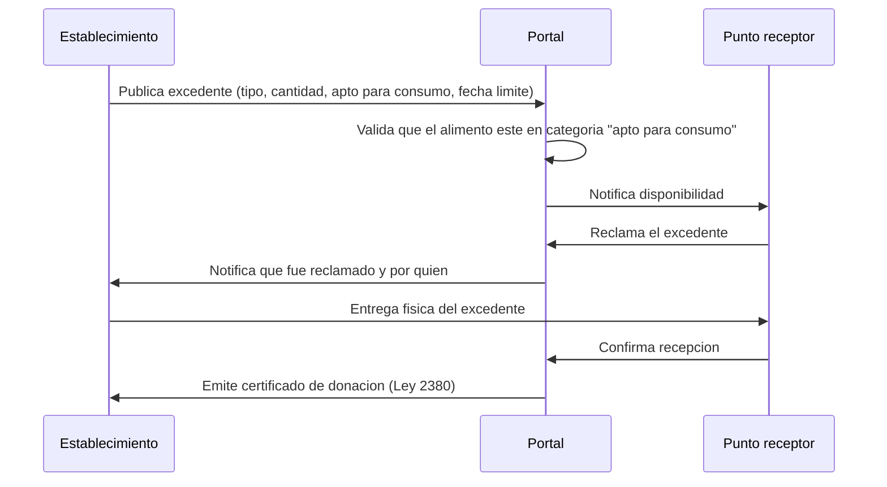
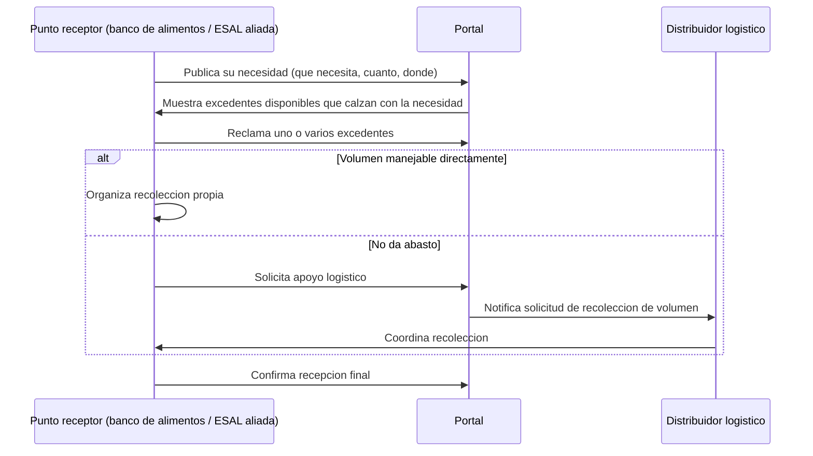
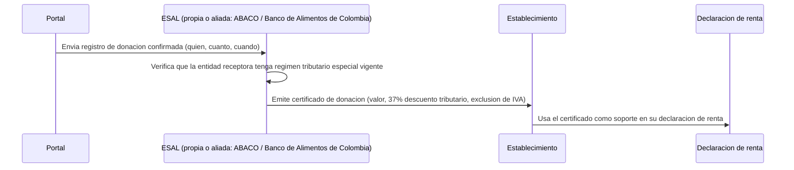
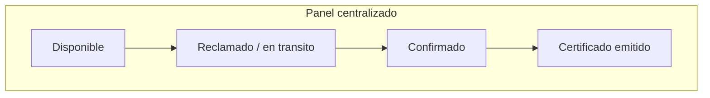

# Workflow del portal

Este documento es la referencia de los flujos operativos del portal, pensada para que el equipo construya en orden y para que la demo se pueda explicar paso a paso frente al jurado. No incluye implementación: es el mapa antes de escribir código.

## 1. Flujo del establecimiento (lado oferta)

**Regla de negocio clave:** solo se publican alimentos aptos para consumo humano. Cualquier excedente que no cumpla esa condición no entra al portal (queda fuera de alcance, corresponde a otra categoría de manejo de residuos).

## 2. Flujo del punto receptor (lado demanda)

## 3. Flujo de certificación (ESAL)

**Nota:** mientras la ESAL propia no tenga resuelto su régimen tributario especial ante la DIAN, este paso se ejecuta en alianza con una ESAL ya reconocida (ver `docs/MARCO_LEGAL.md`). El portal no debe prometer un certificado que no puede respaldar legalmente.

## 4. Vista operativa centralizada

Transversal a los tres flujos anteriores. El panel central debe responder, en todo momento, estas preguntas sin que el usuario tenga que buscarlas:

- ¿Qué excedentes hay disponibles ahora mismo, y dónde?
- ¿Qué necesidades hay sin cubrir?
- ¿Qué está en tránsito (reclamado pero no confirmado)?
- ¿Cuánto se ha certificado como donación en el periodo (para que el establecimiento vea su beneficio acumulado)?

## Orden de construcción sugerido (ver también `docs/ROADMAP.md`)

1. Publicar excedente (establecimiento) — sin esto no hay nada que mostrar.
2. Ver disponible + reclamar (punto receptor) — cierra el loop mínimo demostrable.
3. Confirmar recepción + emitir certificado — es el momento que más impacta en la demo.
4. Panel centralizado — se arma con los datos que ya generan los tres pasos anteriores, no antes.
5. Apoyo de distribuidor logístico y necesidades publicadas por el receptor — quedan para si sobra tiempo; no son necesarios para que el loop principal se vea funcionando.
